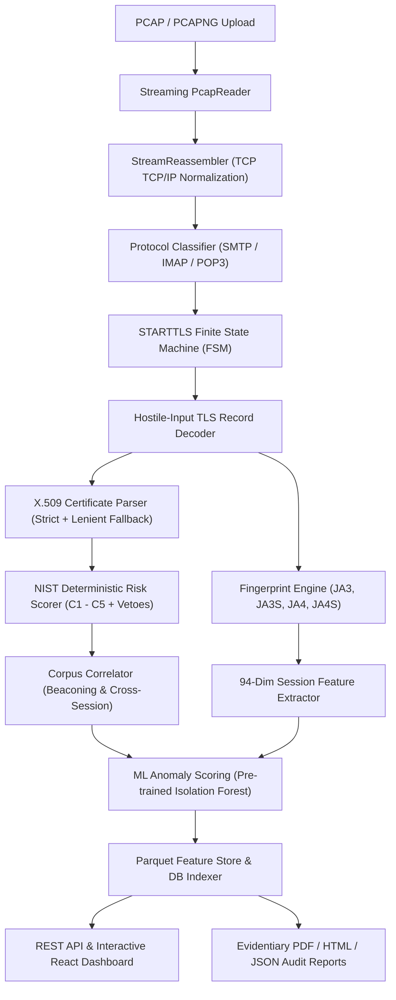

# PostureMail (PECFF)

**Passive Email Cryptographic Forensics Framework**  
*Deterministic NIST SP 800-57 Risk Engine, Passive Stream Reassembly, and 94-Dimensional Machine Learning Forensics.*

[](https://www.python.org/)
[](https://fastapi.tiangolo.com/)
[](https://react.dev/)
[](https://www.docker.com/)
[](LICENSE)

---

## Overview

**PostureMail** is a high-performance, passive network forensics framework engineered to analyze email protocol traffic (**SMTP, IMAP, POP3**) captured in PCAP/PCAPNG format. It operates strictly out-of-band—performing **zero active network I/O**, zero DNS lookups, and zero online OCSP/CRL queries—to ensure auditable, evidentiary-grade analysis without altering network state or alerting adversaries.

PostureMail reconstructs TCP conversations, tracks explicit/implicit STARTTLS protocol transitions, decodes raw TLS records and X.509 certificate chains, scores cryptographic posture deterministically per **NIST SP 800-57 Part 1 Rev. 5**, computes unsupervised machine learning anomaly scores over a **94-dimensional feature pipeline**, and generates court-admissible audit reports with byte-level provenance.

---

## Key Capabilities

1. **Passive Streaming Reassembly:**
   - Unified `PcapReader` supporting microsecond and nanosecond PCAPs, PCAPNG with multiple interface descriptions, and QinQ / 802.1Q VLAN unwrapping.
   - Bounded-memory `StreamReassembler` with Out-Of-Order (OOO) segment queues, window validation, and capture-clock LRU eviction.

2. **STARTTLS Protocol State Machine:**
   - Protocol classification across SMTP (25, 465, 587), IMAP (143, 993), and POP3 (110, 995).
   - Tracks STARTTLS command-response sequences (`EHLO` $\rightarrow$ `STARTTLS` $\rightarrow$ `220 Ready` $\rightarrow$ TLS Handshake).
   - Real-time detection of protocol downgrades, STARTTLS stripping, and cleartext credential leakage (`AUTH PLAIN`, `AUTH LOGIN`, `USER`/`PASS`).

3. **Deterministic NIST SP 800-57 Cryptographic Risk Engine:**
   - **Component 1 (Protocol Version):** Prohibits SSL 2.0 / 3.0 (veto); penalizes TLS 1.0, 1.1, and unrecognized versions.
   - **Component 2 (Cipher Suite & Hash):** Evaluates AEAD encryption, Perfect Forward Secrecy (PFS), weak MACs (MD5, SHA-1), and legacy ciphers (RC4, 3DES, EXPORT, NULL).
   - **Component 3 (Key Exchange):** Evaluates ECDHE curve strengths (NIST P-curves, X25519) and penalizes weak DH groups (Logjam attack, $p < 2048$ bits) or static RSA key transport.
   - **Component 4 (Certificate & Trust):** Validates offline X.509 certificates, SAN coverage, SHA-1/MD5 signatures, validity intervals against capture timestamps, and self-signed certificates.
   - **Component 5 (Session Hygiene):** Audits Extended Master Secret (RFC 7627), Encrypt-then-MAC (RFC 7366), secure renegotiation (RFC 5746), and record compression (CRIME).
   - **Veto Dominance & Strength Gate:** Categorical floors guarantee critical flaws (e.g., NULL ciphers, expired certs, cleartext creds) cannot be diluted by good parameters. Minimum effective security threshold is gated at **112 bits**.
   - **TLS 1.3 Opacity Redistribution:** Automatically redistributes certificate weight across remaining components when TLS 1.3 encrypts handshake certificates.

4. **94-Dimensional Unsupervised ML Anomaly Detection:**
   - Compact vectorization across **Fingerprint block** (JA3, JA3S, JA4, JA4S via `HashingVectorizer`), **Cipher profile** (15 dims), **Extension profile** (11 dims), **Crypto parameters** (10 dims), **Session metadata** (18 dims), and **Behavioral metadata** (8 dims).
   - Pre-trained and versioned `IsolationForest` model inference with partitioned Parquet feature persistence under `data/features/{analysis_id}/`.

5. **Corpus Correlation & C2 Beaconing Detection:**
   - Inter-session periodicity analysis (FFT & autocorrelation) for detecting automated command-and-control beaconing over TLS.
   - Domain fronting and SNI mismatch correlation.

6. **Interactive Security Operations Dashboard:**
   - Single-page application built with React, Vite, and Tailwind CSS.
   - Real-time task progress tracking, interactive session explorer, finding breakdowns, certificate viewer, and instant forensic PDF/HTML report exports.

---

## Architectural Pipeline



---

## Project Structure

```text
PostureMail/
├── alembic/                    # Database migration scripts (PostgreSQL)
├── data/
│   ├── ciphers.json            # IANA TLS cipher suite database with NIST metadata
│   ├── feature_manifest.json   # 94-dimensional feature vector specification
│   ├── models/                 # Pre-trained ML model and vectorizer artifacts
│   │   ├── anomaly_detector.joblib
│   │   └── vectorizer.joblib
│   └── storage/                # Local capture storage fallback
├── docker-compose.yml          # Infrastructure orchestration (Postgres, Redis, MinIO)
├── Dockerfile                  # Production container definition
├── frontend/                   # React + Vite + TailwindCSS Dashboard
│   ├── src/                    # UI Components, pages, hooks, API client
│   └── package.json
├── pyproject.toml              # Build system, dependencies, and pytest configuration
├── src/pecff/                  # Core Python Framework package
│   ├── api/                    # FastAPI routers, schemas, dependencies, auth
│   ├── config.py               # Centralized settings via pydantic-settings
│   ├── crypto/                 # NIST risk engine, cipher DB, strength gates, X.509 parser
│   ├── db/                     # SQLAlchemy models and session lifecycle
│   ├── engine/                 # Corpus-level correlation, beaconing detectors
│   ├── ingest/                 # PcapReader, StreamReassembler, link-layer decoders
│   ├── ml/                     # 94-dim feature vectorizer, fingerprints, model loader, train utility
│   ├── parse/                  # STARTTLS FSM, TLS handshake decoder, protocol classifier
│   ├── report/                 # PDF, HTML, and CSV forensic report generators
│   └── tasks/                  # Celery canvas pipeline (sharding, scoring, ML, persistence)
├── tests/                      # Automated test suite (66+ unit, integration, bench tests)
│   ├── bench/                  # Torture PCAPs, synthetic generators, performance benchmarks
│   ├── crypto/                 # Deterministic scoring, veto dominance, certificate tests
│   ├── ml/                     # Feature vector extraction, Parquet persistence tests
│   └── regression/             # Comprehensive Phase 1 regression test suite
└── changes.md                  # Granular audit log of all fixes and changes
```

---

## Prerequisites

- **Python:** `3.12+`
- **Node.js:** `18.0+` & `npm`
- **Docker & Docker Compose:** Required for distributed mode (PostgreSQL 16, Redis 7, MinIO).
- **System Libraries (for PDF generation):**
  - macOS: `brew install pango cairo libffi`
  - Linux (Ubuntu/Debian): `sudo apt-get install -y libpango-1.0-0 libcairo2 libffi-dev`

---

## Quickstart & How to Run

### Option 1: Standalone CLI Analysis (Zero External Services Needed)

For air-gapped forensic workstations or instant PCAP inspection without running background daemons:

```bash
# 1. Clone repository
git clone https://github.com/WaghJagdish/PostureMail.git
cd PostureMail

# 2. Create virtual environment & install dependencies
python3.12 -m venv .venv
source .venv/bin/activate
pip install -e .

# 3. Analyze any PCAP file directly
pecff analyze path/to/capture.pcap --format text
```

You can also output in structured formats:
```bash
# Output formatted JSON report
pecff analyze path/to/capture.pcap --format json > report.json

# Output evidentiary HTML report
pecff analyze path/to/capture.pcap --format html > report.html
```

---

### Option 2: Full Distributed Application Stack

This mode runs the complete web dashboard, async Celery pipeline, PostgreSQL database, and MinIO object storage.

#### Step 1: Start Infrastructure Containers
```bash
docker compose up -d postgres redis minio
```
Services will become available at:
- **PostgreSQL:** `localhost:5432` (`pecff / pecff`)
- **Redis:** `localhost:6379`
- **MinIO Console:** `http://localhost:9001` (`minioadmin / minioadmin`)

#### Step 2: Run Database Migrations
```bash
alembic upgrade head
```

#### Step 3: Start Celery Worker
In a separate terminal:
```bash
source .venv/bin/activate
celery -A pecff.tasks.celery_app worker --loglevel=info -Q pecff.ingest,pecff.score,pecff.ml,pecff.report
```

#### Step 4: Start FastAPI Backend Server
In a separate terminal:
```bash
source .venv/bin/activate
uvicorn pecff.api.main:app --host 0.0.0.0 --port 8000 --reload
```
Interactive API documentation will be accessible at:
- **Swagger UI:** `http://localhost:8000/docs`
- **ReDoc:** `http://localhost:8000/redoc`

#### Step 5: Start the React Frontend Dashboard
In a separate terminal:
```bash
cd frontend
npm install
npm run dev
```
Open **`http://localhost:5173`** in your browser to access the PostureMail dashboard.

---

## Running the Automated Test Suite

PostureMail includes a comprehensive test suite covering unit tests, property-based tests, performance benchmarks, and synthetic attack vectors.

Run tests using `pytest`:
```bash
# Run all core tests
pytest tests/ -v

# Run the focused Phase 1 regression suite
pytest tests/regression/test_phase1_fixes.py -v

# Run benchmark throughput and synthetic attack regression tests
pytest tests/bench/test_performance.py tests/bench/test_regression.py -v
```

---

## Cryptographic Risk Scoring Model

The deterministic risk engine computes an auditable score from $0$ to $100$:

$$\text{Base Score} = \sum_{i=1}^{5} (W_i \times C_i)$$

$$\text{Final Score} = \min\left(100, \, \max\left(\max(\text{Vetoes}), \, \text{Base Score} \times \Omega\right)\right)$$

Where:
- $C_1$: **Protocol Version** ($W_1 = 0.25$)
- $C_2$: **Cipher & Hash Strength** ($W_2 = 0.25$)
- $C_3$: **Key Exchange Mechanism** ($W_3 = 0.20$)
- $C_4$: **Certificate & PKI Validation** ($W_4 = 0.20$)
- $C_5$: **Session Hygiene Extensions** ($W_5 = 0.10$)
- $\Omega$: **Context Multiplier** (1.0 default; 1.15 on mail submission ports 465/587; 1.25 when cleartext credentials are observed)
- **Veto Dominance:** Categorical floors (e.g., NULL ciphers, expired certs, cleartext credentials) set an immutable lower bound.

### Classification Bands:
- **`0 – 19`:** SECURE (Approved NIST cryptographic parameters)
- **`20 – 39`:** ACCEPTABLE (Minor legacy parameters present)
- **`40 – 59`:** WEAK (Deprecated algorithms or non-PFS ciphers)
- **`60 – 79`:** HIGH RISK (Severe protocol or certificate deficiencies)
- **`80 – 100`:** CRITICAL (Prohibited cipher, cleartext auth credentials, or active exploit)

---

## License

This project is licensed under the MIT License — see the [LICENSE](LICENSE) file for details.
